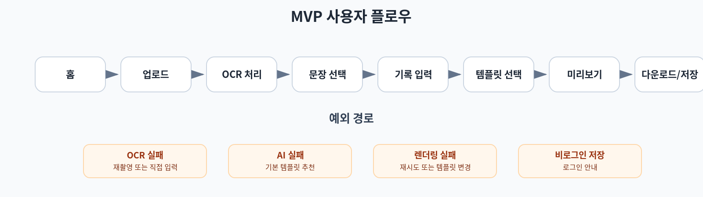
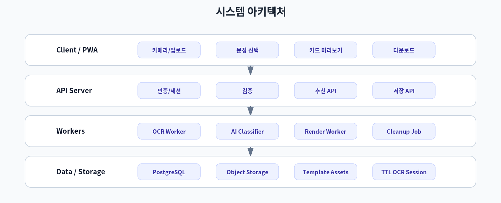
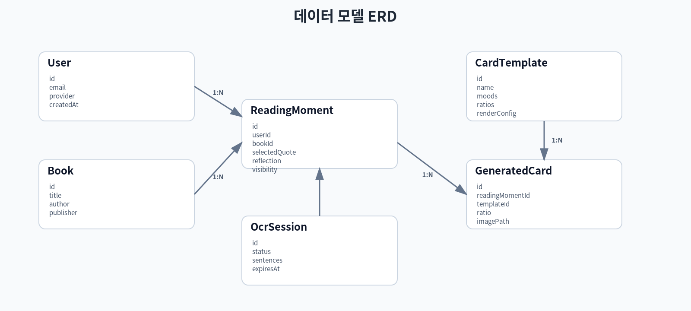
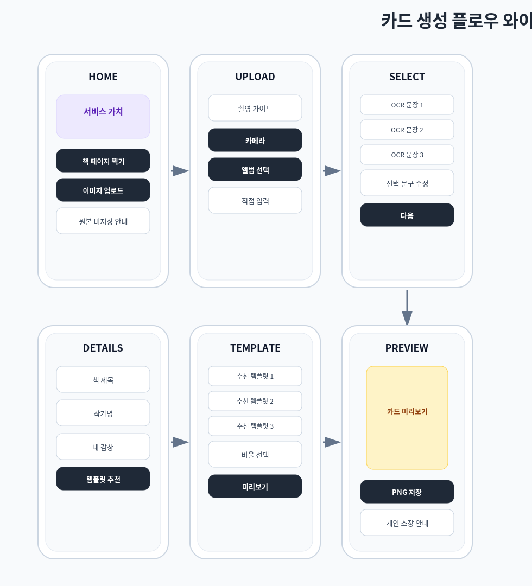
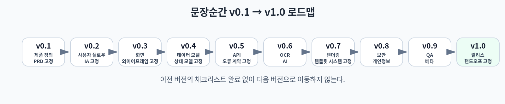

# 문장순간 통합 설계서 v1.0

- 기준일: 2026-06-23
- 산출물 범위: v0.1 제품 정의부터 v1.0 릴리스 핸드오프까지
- 원본 브리프: `source/quote-card-product-brief.md`

## 1. 제품 정의

`문장순간`은 책 페이지 이미지를 OCR로 읽어 사용자가 선택한 짧은 문구와 자신의 감상을 함께 이미지 카드로 저장하는 개인 독서 순간 아카이브다.

## 2. MVP 핵심 플로우



```text
홈 → 업로드 → OCR → 문장 선택 → 기록 입력 → 템플릿 선택 → 미리보기 → 다운로드/저장
```

## 3. 시스템 아키텍처



- Client: 업로드, 문장 선택, 입력, 미리보기
- API Server: 세션, 검증, 추천, 저장
- OCR Worker: 이미지 OCR, 문장 분리, 원본 삭제
- AI Classifier: mood/style 태그 생성
- Render Worker: HTML/SVG 기반 PNG 생성
- Storage: 템플릿 에셋, 생성 카드, 임시 다운로드 파일
- DB: Book, ReadingMoment, CardTemplate, GeneratedCard

## 4. 데이터 모델



핵심은 `ReadingMoment`다. `GeneratedCard`는 결과물이고, `CardTemplate`은 재사용 가능한 디자인 템플릿이다. `OcrSession`은 임시 데이터로만 유지한다.

## 5. 화면 설계



| 화면 | 목적 |
|---|---|
| HOME | 시작과 가치 전달 |
| CREATE_UPLOAD | 책 페이지 이미지 업로드 |
| OCR_PROCESSING | OCR 진행/실패 처리 |
| SELECT_QUOTE | 문장 선택/수정 |
| MOMENT_DETAILS | 책 정보/감상 입력 |
| TEMPLATE_SELECT | 추천 템플릿과 비율 선택 |
| PREVIEW | 카드 미리보기/렌더링 |
| SAVE_COMPLETE | 다운로드/보관함 저장 |

## 6. API

전체 API 계약은 `specs/openapi.yaml`에 정리했다.

핵심 API:

```text
POST /api/ocr
POST /api/theme/classify
GET  /api/card-templates
POST /api/card-templates/recommend
POST /api/cards/render
GET  /api/cards/{cardId}/download
POST /api/reading-moments
GET  /api/reading-moments
DELETE /api/reading-moments/{id}
```

## 7. AI/OCR/추천

- OCR은 문장 후보 추출만 담당한다.
- AI는 분위기 분류와 추천 태그 생성만 담당한다.
- 전체 OCR 원문은 AI에 보내지 않는다.
- 추천 엔진은 mood, genre, textLength, ratio, emphasis 점수로 top 3 템플릿을 선정한다.

## 8. 렌더링/템플릿

MVP 템플릿 5종:

1. 여백의 문장
2. 비 오는 창가
3. 밤의 책상
4. 대출카드
5. 책갈피

샘플 이미지는 `assets/sample_cards/`에 포함했다.

## 9. 저작권/개인정보 정책

MVP는 다음을 제공하지 않는다.

- 공개 피드
- SNS 자동 공유
- 긴 문단 저장
- 페이지 전체 카드화
- 여러 페이지 연속 OCR
- 책 전체 요약

저장 정책:

- 원본 책 이미지는 OCR 후 삭제한다.
- OCR 전체 텍스트는 임시 세션으로만 보관한다.
- 사용자가 선택한 짧은 문구와 감상, 책 정보만 저장한다.
- 기본 visibility는 private이다.

## 10. 버전 로드맵



| 버전 | 단계 |
|---|---|
| v0.1 | 제품 정의/PRD 고정 |
| v0.2 | 사용자 플로우/IA 고정 |
| v0.3 | 화면/와이어프레임 고정 |
| v0.4 | 데이터 모델/상태 모델 고정 |
| v0.5 | API/오류 계약 고정 |
| v0.6 | OCR/AI/추천 명세 고정 |
| v0.7 | 렌더링/템플릿 시스템 고정 |
| v0.8 | 보안/개인정보/저작권 안전장치 고정 |
| v0.9 | QA/베타/운영 지표 고정 |
| v1.0 | 릴리스/핸드오프 고정 |


## 11. 개발 이슈

개발 백로그는 `issues/development_backlog.md`에 분해했다.

## 12. 출시 기준

- OCR 성공률 80% 이상
- 정상 입력 기준 카드 생성 완료율 95% 이상
- 1:1, 4:5, 9:16 모든 비율 렌더링 정상
- 원본 이미지 미저장 검증
- 비로그인 다운로드 가능
- 로그인 사용자 보관함 저장/삭제 가능

## 13. 최종 판단

개발 착수 가능한 수준의 v1.0 설계로 고정한다. 단, 실제 상용 출시 전에는 저작권/개인정보 문구에 대해 법무 또는 정책 검토를 별도로 수행한다.
